```mermaid
graph TD
  subgraph "Local Machine"
    A[MCP Server: Nasdaq Data Link MCP] --> C[MCP Client, ie. Claude Desktop]
  end

  C -->|user prompt| D[LLM ie. Claude 3.7 Sonnet]
  D -->|calls tool| A
  A -->|fetches data| B[Nasdaq Data Link API]
  B -.-> E[Retail Trading Activity Tracker]
  B -.-> F[World Bank Metadata]
  B -.-> N[Trade Summary NDAQ/TS]
  
  subgraph "Nasdaq Fund Network (NFN)"
    O1[Fund Master MFRFM]
    O2[Fund Information MFRFI]
    O3[Share Class Master MFRSM]
    O4[Share Class Info MFRSI]
    O5[Price History MFRPH/MFRPH10]
    O6[Performance MFRPS/MFRPRB/MFRPA]
    O7[Fees & Expenses MFRPM]
    O8[Monthly Flows MFRMF]
  end
  
  B -.-> O1
  B -.-> O2
  B -.-> O3
  B -.-> O4
  B -.-> O5
  B -.-> O6
  B -.-> O7
  B -.-> O8
  
  subgraph " "
    G[Statistics NDAQ/STAT]
    H[Fundamentals NDAQ/FS]
    I[Fundamental Details NDAQ/FD]
    J[Balance Sheet NDAQ/BS]
    K[Cash Flow NDAQ/CF]
    L[Corporate Actions NDAQ/CA]
    M[Reference Data NDAQ/RD]
  end

B -.->|Equities 360| G
```

<div align="center">

# 📈 Nasdaq Data Link MCP 🤖 

</div>

<div align="center">

[](LICENSE)
[](https://pypi.org/project/nasdaq-data-link-mcp-os/)


[](https://pepy.tech/projects/nasdaq-data-link-mcp-os)


</div>

A community developed and maintained [Model Context Protocol (MCP)](https://github.com/modelcontextprotocol) server that provides access for large language models to the [Nasdaq Data Link](https://data.nasdaq.com/). Built for use with MCP-compatible [clients](https://modelcontextprotocol.io/clients).

This project aims at making easy to access and explore Nasdaq Data Link’s extensive and valuable financial and economic datasets through natural language interfaces and large language models (LLMs).

🐍 `Nasdaq Data Link MCP` uses the official [Nasdaq/data-link-python](https://github.com/Nasdaq/data-link-python) SDK.

> [!IMPORTANT]
> This is an open-source project *not affiliated with or endorsed by Nasdaq, Inc.* Nasdaq® is a registered trademark of Nasdaq, Inc.

## 🌐 Usage

| [](https://www.loom.com/share/b0299f6f6f1844669b5d2f73a86a3dcb) | [](https://www.loom.com/share/a07e518bb6eb4de4b5a06a5a1a112a24) |
|:--:|:--:|
| [Nasdaq Data Link MCP - Retail Trading Activity](https://www.loom.com/share/b0299f6f6f1844669b5d2f73a86a3dcb) | [Nasdaq Data Link MCP - World Bank Data](https://www.loom.com/share/a07e518bb6eb4de4b5a06a5a1a112a24) |
| [](https://www.loom.com/share/46c7df4cb4c4405aa9e0a49ce6cd75be) | |
| [Nasdaq Data Link MCP - Groq + DeepSeek R1 RTAT 10](https://www.loom.com/share/46c7df4cb4c4405aa9e0a49ce6cd75be) | | 

> [!TIP]
> If you use this project in your research or work, please cite it using the [CITATION.cff](CITATION.cff) file, or the APA format:


Once installed and connected to an `MCP`-compatible client (e.g., [Claude Desktop](https://claude.ai/download), or [Groq Desktop (beta)](https://github.com/groq/groq-desktop-beta), this server exposes several tools that your AI assistant can use to fetch data.

This project currently supports the following databases:
- [Equities 360](https://data.nasdaq.com/databases/E360) (company statistics and fundamental data)
- [Nasdaq RTAT](https://data.nasdaq.com/databases/RTAT) (retail trading activity tracker)
- [Trade Summary](https://data.nasdaq.com/databases/TRDSUM) (consolidated trade data including OHLCV)
- [World Bank dataset on Nasdaq Data Link](https://data.nasdaq.com/databases/WB) (world bank database)
- [Nasdaq Fund Network (NFN)](https://data.nasdaq.com/databases/MFR) (mutual fund and investment product data)

<details>
<summary><strong>Example conversations</strong></summary>

> **You:** What were the most traded stocks by retailers yesterday?  
> **Claude:** *calls `get_rtat(<yetserday>)` and returns relevant matches*

> **You:** What was the GDP of Italy in 2022?  
> **Claude:** Let me look that up... *calls `get_indicator_value` tool*  
> **Claude:** The GDP of Italy in 2022 was approximately `...` trillion USD.

> **You:** List all indicators related to CO₂ emissions.  
> **Claude:** *calls `search_worldbank_indicators("CO2")` and returns relevant matches*

> **You:** What's the latest trading data for Apple?  
> **Claude:** *calls `get_trade_summary_data()` and presents the trading data*

> **You:** Show me yesterday's trading volume for the top tech stocks.
> **Claude:** *calls `get_trade_summary_data()` and analyzes volume data*

> **You:** What's the market cap and P/E ratio of Microsoft?  
> **Claude:** *calls `get_stock_stats(symbol="MSFT")` and presents the key statistics*

> **You:** Show me Microsoft's profitability ratios for the most recent annual report.  
> **Claude:** *calls `get_fundamental_data(symbol="MSFT", dimension="MRY")` and presents profitability metrics*

> **You:** What's Microsoft's cash flow and R&D spending for the last quarter?  
> **Claude:** *calls `get_detailed_financials(symbol="MSFT", dimension="MRQ")` and presents cash flow and R&D data*

> **You:** What's Microsoft's asset breakdown and debt-to-equity ratio from the latest balance sheet?  
> **Claude:** *calls `get_balance_sheet_data(symbol="MSFT", dimension="MRQ")` and presents relevant balance sheet items*

> **You:** How has Microsoft's free cash flow and capital expenditure changed over the past year?  
> **Claude:** *calls `get_cash_flow_data(symbol="MSFT", dimension="MRY")` and analyzes free cash flow trends*

> **You:** Has Tesla had any stock splits in the last two years?  
> **Claude:** *calls `get_corporate_action_data(symbol="TSLA", action="split")` and presents the split history*

> **You:** What industry and sector is AMD in, and where is the company located?  
> **Claude:** *calls `get_company_reference_data(symbol="AMD")` and presents industry, sector, and location information*

> **You:** Can you find information about mutual funds that are open-ended?  
> **Claude:** *calls `get_fund_master_report(investment_company_type="N-1A")` and returns the fund information*

> **You:** Show me the performance metrics for fund ABCDX for the past year  
> **Claude:** *calls `get_performance_statistics(ticker="ABCDX")` and presents the performance metrics*

> **You:** What are the fees associated with the Growth Fund?  
> **Claude:** *first finds the fund ID with `get_fund_master_report(name="Growth Fund")`, then calls `get_fees_and_expenses(fund_id="{fund_id}")` and presents the fee structure*

> **You:** Compare the historical NAV for ABCDX over the last month  
> **Claude:** *calls `get_price_history(ticker="ABCDX", start_date="{30 days ago}", end_date="{today}")` and presents the NAV trend*

> **You:** What is the investment strategy of fund ABCDX?  
> **Claude:** *first finds the fund ID with `get_share_class_information(ticker="ABCDX")`, then calls `get_fund_information(fund_id="{fund_id}")` and presents the investment strategy*
</details>

---

## 📦 Installation

### 1. Clone the Repository

```bash
git clone repo
cd nasdaq-data-link-mcp
```

### 2. Install Requirements

You'll need Python 3.13+ and the `mcp` CLI.

```bash
uv init mcp
uv add "mcp[cli]"
```

> MCP SDK: https://github.com/modelcontextprotocol/python-sdk  
> Nasdaq Data Link SDK: https://github.com/Nasdaq/data-link-python

### 3. Get Your API Key

Sign up on [https://data.nasdaq.com/](https://data.nasdaq.com/) and copy your API key.

### 4. Configure the Environment

```bash
cp .env.example .env
```

Then edit `.env` and add your API key:

```
NASDAQ_DATA_LINK_API_KEY=your_api_key_here
```

And the `PYTHONPATH`: 
```
PYTHONPATH=/path/to/your/local/cloned/repo/nasdaq-data-link-mcp
```

### 5. Install the MCP Server

```bash
uv run mcp install nasdaq_data_link_mcp_os/server.py --env-file .env --name "Nasdaq Data Link MCP Server" --with nasdaq-data-link --with pycountry
```

This registers the server with your MCP client (e.g., Claude Desktop).

---

## 🚀 Local Development

### Prerequisites

- Python 3.8+ (3.13+ recommended)
- [uv](https://docs.astral.sh/uv/) package manager
- A [Nasdaq Data Link API key](https://data.nasdaq.com/)

### Quick Start

1. **Clone and navigate to the project**
   ```bash
   git clone <repository-url>
   cd nasdaq-data-link-mcp
   ```

2. **Install dependencies with uv**
   ```bash
   uv sync
   ```
   This will create a virtual environment and install all required packages.

3. **Set up environment variables**
   ```bash
   cp .env.example .env
   ```
   Edit `.env` and add your Nasdaq Data Link API key:
   ```bash
   NASDAQ_DATA_LINK_API_KEY=your_api_key_here
   PYTHONPATH=.
   ```

4. **Run the server locally**

   **Option A: Default MCP Protocol (stdio)**
   ```bash
   PYTHONPATH=. uv run python nasdaq_data_link_mcp_os/server.py
   ```
   This runs the server in stdio mode for MCP client communication.

   **Option B: HTTP Server with Server-Sent Events**
   ```bash
   PYTHONPATH=. uv run python nasdaq_data_link_mcp_os/server.py --transport sse --host 0.0.0.0 --port 8000
   ```
   This starts an HTTP server on `http://0.0.0.0:8000` that can be accessed via web browsers or HTTP clients.

   **Option C: HTTP Server (alternative)**
   ```bash
   PYTHONPATH=. uv run python nasdaq_data_link_mcp_os/server.py --transport streamable-http --host 0.0.0.0 --port 8000
   ```

### Available Command Line Options

```bash
python nasdaq_data_link_mcp_os/server.py --help
```

- `--transport`: Choose transport protocol (`stdio`, `sse`, `streamable-http`)
- `--host`: Host to bind HTTP server to (default: `0.0.0.0`)
- `--port`: Port to bind HTTP server to (default: `8080`)

### 🧪 Testing Your Local Server

**For stdio transport (default):**
The server will wait for JSON-RPC messages via stdin/stdout. This is the standard MCP protocol.

**For HTTP transports:**
- Visit `http://localhost:8000` in your browser (if using `--host 0.0.0.0`)
- Visit `http://127.0.0.1:8000` for localhost-only binding
- The server accepts MCP protocol messages via Server-Sent Events or HTTP

### 🔧 Development Workflow

1. **Make your changes** to the code
2. **Run tests** to verify functionality:
   ```bash
   uv run python -m pytest tests/ -v
   ```
3. **Test locally** with your preferred transport method
4. **For Kubernetes deployment**, see the `helm/` directory

### 📝 Environment Variables

| Variable | Description | Required | Default |
|----------|-------------|----------|---------|
| `NASDAQ_DATA_LINK_API_KEY` | Your Nasdaq Data Link API key | ✅ Yes | None |
| `PYTHONPATH` | Python path (should be set to `.`) | ✅ Yes | None |

### 🐳 Docker Deployment

The NASDAQ Data Link MCP server can be easily deployed using Docker for both development and production use.

#### Prerequisites
- [Docker](https://docs.docker.com/get-docker/) installed on your system
- A valid [Nasdaq Data Link API key](https://data.nasdaq.com/)

#### Quick Start with Docker

**Option A: Use pre-built image from Docker Hub (Recommended)**
```bash
# Run the latest version
docker run -d --name nasdaq-mcp \
  -p 8000:8000 \
  -e NASDAQ_DATA_LINK_API_KEY=your_api_key_here \
  bfljerum/nasdaq-data-link-mcp:latest

# Or run a specific version
docker run -d --name nasdaq-mcp \
  -p 8000:8000 \
  -e NASDAQ_DATA_LINK_API_KEY=your_api_key_here \
  bfljerum/nasdaq-data-link-mcp:v0.2.4
```

**Option B: Build from source**

**1. Build the Docker image:**
```bash
docker build -t nasdaq-mcp-server .
```

**2. Run the container:**

**Run in detached mode (background)**
```bash
docker run -d --name nasdaq-mcp \
  -p 8000:8000 \
  -e NASDAQ_DATA_LINK_API_KEY=your_api_key_here \
  nasdaq-mcp-server:latest
```

**Run in foreground (see logs)**
```bash
docker run --name nasdaq-mcp \
  -p 8000:8000 \
  -e NASDAQ_DATA_LINK_API_KEY=your_api_key_here \
  bfljerum/nasdaq-data-link-mcp:latest
```

**3. Access the server:**
- Open your browser to `http://localhost:8000`
- The server runs with SSE (Server-Sent Events) transport by default

#### Docker Management Commands

**Check if container is running:**
```bash
docker ps
```

**View container logs:**
```bash
# View recent logs
docker logs nasdaq-mcp

# Follow logs in real-time
docker logs -f nasdaq-mcp
```

**Stop the container:**
```bash
docker stop nasdaq-mcp
```

**Start the container again:**
```bash
docker start nasdaq-mcp
```

**Remove the container:**
```bash
docker rm nasdaq-mcp
```

#### Advanced Docker Usage

**Run with custom configuration:**
```bash
docker run -d --name nasdaq-mcp \
  -p 8000:8000 \
  -e NASDAQ_DATA_LINK_API_KEY=your_api_key_here \
  --restart unless-stopped \
  --memory="512m" \
  --cpus="0.5" \
  nasdaq-mcp-server:latest
```

**Run with volume for logs:**
```bash
docker run -d --name nasdaq-mcp \
  -p 8000:8000 \
  -e NASDAQ_DATA_LINK_API_KEY=your_api_key_here \
  -v $(pwd)/logs:/app/logs \
  nasdaq-mcp-server:latest
```

**Override default transport mode:**
```bash
# Run with stdio transport (for MCP client integration)
docker run -i --name nasdaq-mcp-stdio \
  -e NASDAQ_DATA_LINK_API_KEY=your_api_key_here \
  nasdaq-mcp-server:latest \
  python nasdaq_data_link_mcp_os/server.py --transport stdio

# Run with streamable-http transport
docker run -d --name nasdaq-mcp-http \
  -p 8000:8000 \
  -e NASDAQ_DATA_LINK_API_KEY=your_api_key_here \
  nasdaq-mcp-server:latest \
  python nasdaq_data_link_mcp_os/server.py --transport streamable-http --host 0.0.0.0 --port 8000
```

#### Docker Compose (Optional)

Create a `docker-compose.yml` file:
```yaml
version: '3.8'
services:
  nasdaq-mcp:
    build: .
    ports:
      - "8000:8000"
    environment:
      - NASDAQ_DATA_LINK_API_KEY=your_api_key_here
    restart: unless-stopped
    healthcheck:
      test: ["CMD", "python", "-c", "import socket; s=socket.socket(); s.settimeout(5); s.connect(('0.0.0.0', 8000)); s.close()"]
      interval: 30s
      timeout: 10s
      retries: 3
      start_period: 5s
```

Run with Docker Compose:
```bash
docker-compose up -d
```

#### Container Features

- **🔒 Security**: Runs as non-root user (`appuser`)
- **📊 Health Checks**: Built-in health monitoring
- **🔄 Signal Handling**: Proper shutdown with tini init system
- **📦 Optimized**: Multi-stage build for smaller image size
- **📝 Logging**: Structured logging to `/app/logs`

---

## ☸️ Kubernetes Deployment with Helm

Deploy the NASDAQ Data Link MCP server to Kubernetes using the included Helm chart for scalable, production-ready deployments.

### Prerequisites

- Kubernetes cluster (1.19+)
- Helm 3.x installed
- kubectl configured
- A valid [Nasdaq Data Link API key](https://data.nasdaq.com/)

### Quick Start

**1. Navigate to the Helm chart directory:**
```bash
cd helm
```

**2. Install using the enhanced installation script:**
```bash
# Show all available options
./install.sh --help

# Basic installation (will prompt for API key and namespace)
./install.sh

# Advanced installation with custom options
./install.sh nasdaq-mcp --image-tag v0.2.4 --values custom-values.yaml --upgrade
```

**Alternative manual installation:**
```bash
# Create namespace
kubectl create namespace mcp-servers

# Install with your API key
helm install nasdaq-mcp . -n mcp-servers \
  --set secret.nasdaqApiKey="your_api_key_here" \
  --create-namespace
```

### Configuration Options

The Helm chart supports extensive customization through values.yaml:

| Parameter | Description | Default |
|-----------|-------------|---------|
| `image.repository` | Docker image repository | `bfljerum/nasdaq-data-link-mcp` |
| `image.tag` | Docker image tag | `latest` |
| `image.pullPolicy` | Image pull policy | `IfNotPresent` |
| `mcp.transport` | MCP transport protocol | `sse` |
| `mcp.server.host` | Server bind host | `0.0.0.0` |
| `mcp.server.port` | Server bind port | `8000` |
| `service.type` | Kubernetes service type | `ClusterIP` |
| `service.port` | Service port | `8000` |
| `ingress.enabled` | Enable ingress | `false` |
| `resources.limits.cpu` | CPU limit | `500m` |
| `resources.limits.memory` | Memory limit | `512Mi` |
| `secret.create` | Create secret for API key | `true` |
| `secret.nasdaqApiKey` | Your Nasdaq API key | `""` |

### Production Deployment

**1. Copy production values:**
```bash
cp examples/values-prod.yaml.example my-production-values.yaml
```

**2. Edit the configuration:**
```yaml
# my-production-values.yaml
image:
  tag: "v0.2.4"  # Use specific version for production
  pullPolicy: IfNotPresent

resources:
  limits:
    cpu: 1000m
    memory: 1Gi
  requests:
    cpu: 500m
    memory: 512Mi

secret:
  nasdaqApiKey: "your_production_api_key_here"

# Enable ingress for external access
ingress:
  enabled: true
  className: "nginx"
  hosts:
    - host: nasdaq-mcp.yourdomain.com
      paths:
        - path: /
          pathType: Prefix
```

**3. Deploy to production:**
```bash
helm install nasdaq-mcp . -n mcp-servers -f my-production-values.yaml
```

### Development Deployment

For development environments:
```bash
cp examples/values-dev.yaml.example my-dev-values.yaml
# Edit as needed
helm install nasdaq-mcp-dev . -n mcp-servers -f my-dev-values.yaml
```

### Helm Management Commands

**Check deployment status:**
```bash
helm status nasdaq-mcp -n mcp-servers
```

**View deployed values:**
```bash
helm get values nasdaq-mcp -n mcp-servers
```

**Upgrade deployment:**
```bash
helm upgrade nasdaq-mcp . -n mcp-servers \
  --set image.tag=v0.2.4 \
  --set secret.nasdaqApiKey="your_api_key"
```

**Uninstall:**
```bash
# Using the enhanced uninstall script (recommended)
./uninstall.sh --help  # Show options
./uninstall.sh         # Basic uninstall with prompts
./uninstall.sh nasdaq-mcp --keep-namespace  # Keep namespace
./uninstall.sh --dry-run  # Preview what would be deleted

# Manual uninstall
helm uninstall nasdaq-mcp -n mcp-servers
```

**Dry run (preview changes):**
```bash
helm template nasdaq-mcp . -n mcp-servers \
  --set secret.nasdaqApiKey="test_key"
```

### Accessing the Service

**1. Port forwarding (for testing):**
```bash
kubectl port-forward service/nasdaq-mcp-nasdaq-data-link-mcp 8080:8000 -n mcp-servers
```
Then access at `http://localhost:8080`

**2. Internal cluster access:**
```bash
# Service URL for other pods in the cluster
http://nasdaq-mcp-nasdaq-data-link-mcp.mcp-servers.svc.cluster.local:8000
```

**3. External access (with ingress):**
Configure ingress in your values file to expose the service externally.

### Monitoring and Troubleshooting

**Check pod status:**
```bash
kubectl get pods -n mcp-servers
```

**View logs:**
```bash
kubectl logs -f deployment/nasdaq-mcp-nasdaq-data-link-mcp -n mcp-servers
```

**Check service endpoints:**
```bash
kubectl get endpoints -n mcp-servers
```

**Describe pod for debugging:**
```bash
kubectl describe pod <pod-name> -n mcp-servers
```

### Security Features

- **🔐 Non-root execution**: Runs as user ID 1001
- **🛡️ Security contexts**: Restricted privileges
- **🔒 Secret management**: API keys stored in Kubernetes secrets
- **📋 Network policies**: Configurable network restrictions
- **🩺 Health probes**: TCP socket health checks on port 8000

### High Availability Setup

For production high availability:
```yaml
replicaCount: 3

podDisruptionBudget:
  enabled: true
  minAvailable: 2

resources:
  limits:
    cpu: 1000m
    memory: 1Gi
  requests:
    cpu: 500m
    memory: 512Mi

nodeSelector:
  kubernetes.io/arch: amd64

tolerations:
  - key: "high-memory"
    operator: "Equal"
    value: "true"
    effect: "NoSchedule"
```

---

## 🧪 Testing

Run the test suite:

```bash
python -m pytest tests/ -v
```

The test suite includes:
- Basic functionality tests
- Module import verification
- Parameter validation
- Error handling
- Integration tests

Tests are designed to work without requiring an API key for basic functionality verification.

---

## 🛠️ Tools

After installation, the following tools are exposed to MCP clients:

---

<details>
<summary><strong>📈 Retail Trading Activity Tracker</strong></summary>

### `get_rtat10`

Retrieves Retail Trading Activity Tracker 10 (RTAT10) data for specific dates and optional tickers.

```json
{
  "action": "tool",
  "name": "get_rtat10",
  "params": {
    "dates": "2025-03-31,2025-03-28,2025-03-27",
    "tickers": "TSLA,TQQQ,SQQQ"
  }
}
```

Returns RTAT10 data from Nasdaq Data Link for the given dates and tickers.

---

### `get_rtat`

Retrieves Retail Trading Activity (RTAT) data for specific dates and optional tickers.

```json
{
  "action": "tool",
  "name": "get_rtat",
  "params": {
    "dates": "2025-03-31,2025-03-28,2025-03-27",
    "tickers": "TSLA,TQQQ,SQQQ"
  }
}
```

Returns RTAT data from Nasdaq Data Link for the given dates and tickers.

</details>

---

<details>
<summary><strong>📊 Trade Summary Tool</strong></summary>

### `get_trade_summary_data`

Retrieves Trade Summary data from Nasdaq Data Link NDAQ/TS datatable.

```json
{
  "action": "tool",
  "name": "get_trade_summary_data"
}
```

Returns consolidated trade data including open, high, low, close, and volume information.

</details>

---

<details>
<summary><strong>📊 World Bank Tools</strong></summary>

### `get_indicator_value`

Fetch the value for a specific indicator and country.

```json
{
  "action": "tool",
  "name": "get_indicator_value",
  "params": {
    "country": "Italy",
    "indicator": "NY.GDP.MKTP.CD"
  }
}
```

Returns the latest value for that indicator.

---

### `country_code`

Returns the ISO 3-letter country code (e.g., `"ITA"` for Italy).

```json
{
  "action": "tool",
  "name": "country_code",
  "params": {
    "countryName": "Italy"
  }
}
```

---

### `list_worldbank_indicators`

Returns a list of all 1500+ indicators available.

```json
{
  "action": "tool",
  "name": "list_worldbank_indicators"
}
```

---

### `search_worldbank_indicators`

Searches for indicators by keyword.

```json
{
  "action": "tool",
  "name": "search_worldbank_indicators",
  "params": {
    "keyword": "population"
  }
}
```

</details>

---

<details>
<summary><strong>📈 Equities 360 Tools</strong></summary>

### `get_stock_stats`

Retrieves comprehensive statistics for a company from the Nasdaq Equities 360 database.

```json
{
  "action": "tool",
  "name": "get_stock_stats",
  "params": {
    "symbol": "MSFT"
  }
}
```

Or using FIGI:

```json
{
  "action": "tool",
  "name": "get_stock_stats",
  "params": {
    "figi": "BBG000BPH459"
  }
}
```

Returns company statistics including market cap, PE ratio, 52-week highs/lows, dividend information, and more.

---

### `list_stock_stat_fields`

Lists all available fields in the stock statistics database with descriptions.

```json
{
  "action": "tool",
  "name": "list_stock_stat_fields"
}
```

Returns information about all available fields that can be queried through the `get_stock_stats` tool.

---

### `get_fundamental_data`

Retrieves fundamental financial data from the Nasdaq Equities 360 Fundamental Summary database.

```json
{
  "action": "tool",
  "name": "get_fundamental_data",
  "params": {
    "symbol": "MSFT",
    "dimension": "MRY"
  }
}
```

Or using multiple parameters:

```json
{
  "action": "tool",
  "name": "get_fundamental_data",
  "params": {
    "figi": "BBG000BPH459",
    "calendardate": "2022-12-31",
    "dimension": "MRQ"
  }
}
```

Returns fundamental data including profitability ratios (ROA, ROE, ROS), valuation metrics (P/E, P/S), income statement items (revenue, gross profit), and financial health indicators (current ratio, debt-to-equity).

---

### `list_fundamental_fields`

Lists all available fields in the fundamental summary database with descriptions.

```json
{
  "action": "tool",
  "name": "list_fundamental_fields"
}
```

Returns information about all available fields that can be queried through the `get_fundamental_data` tool.

---

### `get_detailed_financials`

Retrieves detailed financial data from the Nasdaq Equities 360 Fundamental Details database.

```json
{
  "action": "tool",
  "name": "get_detailed_financials",
  "params": {
    "symbol": "MSFT",
    "dimension": "MRQ"
  }
}
```

Or using multiple parameters:

```json
{
  "action": "tool",
  "name": "get_detailed_financials",
  "params": {
    "figi": "BBG000BPH459",
    "calendardate": "2022-12-31",
    "dimension": "MRY"
  }
}
```

Returns comprehensive financial statement data including balance sheet items (assets, liabilities, equity), income statement components (revenue, expenses, profit), cash flow details (operating, investing, financing), and detailed financial ratios.

---

### `list_detailed_financial_fields`

Lists all available fields in the fundamental details database with descriptions.

```json
{
  "action": "tool",
  "name": "list_detailed_financial_fields"
}
```

Returns information about all available fields that can be queried through the `get_detailed_financials` tool.

---

### `get_balance_sheet_data`

Retrieves balance sheet data from the Nasdaq Equities 360 Balance Sheet database.

```json
{
  "action": "tool",
  "name": "get_balance_sheet_data",
  "params": {
    "symbol": "MSFT",
    "dimension": "MRQ"
  }
}
```

Or using multiple parameters:

```json
{
  "action": "tool",
  "name": "get_balance_sheet_data",
  "params": {
    "figi": "BBG000BPH459",
    "calendardate": "2022-12-31",
    "dimension": "MRY"
  }
}
```

Returns comprehensive balance sheet data including assets (current, non-current, intangible), liabilities (current, non-current, debt), stockholders' equity, and key balance sheet metrics.

---

### `list_balance_sheet_fields`

Lists all available fields in the balance sheet database with descriptions.

```json
{
  "action": "tool",
  "name": "list_balance_sheet_fields"
}
```

Returns information about all available fields that can be queried through the `get_balance_sheet_data` tool.

---

### `get_cash_flow_data`

Retrieves cash flow statement data from the Nasdaq Equities 360 Cash Flow database.

```json
{
  "action": "tool",
  "name": "get_cash_flow_data",
  "params": {
    "symbol": "MSFT",
    "dimension": "MRQ"
  }
}
```

Or using multiple parameters:

```json
{
  "action": "tool",
  "name": "get_cash_flow_data",
  "params": {
    "figi": "BBG000BPH459",
    "calendardate": "2022-12-31",
    "dimension": "MRY"
  }
}
```

Returns cash flow statement data including operating activities (ncfo), investing activities (ncfi), financing activities (ncff), free cash flow (fcf), capital expenditures (capex), and more.

---

### `list_cash_flow_fields`

Lists all available fields in the cash flow statement database with descriptions.

```json
{
  "action": "tool",
  "name": "list_cash_flow_fields"
}
```

Returns information about all available fields that can be queried through the `get_cash_flow_data` tool.

---

### `get_corporate_action_data`

Retrieves corporate actions data from the Nasdaq Equities 360 Corporate Actions database.

```json
{
  "action": "tool",
  "name": "get_corporate_action_data",
  "params": {
    "symbol": "TSLA",
    "action": "split"
  }
}
```

Or using other parameters:

```json
{
  "action": "tool",
  "name": "get_corporate_action_data",
  "params": {
    "date": "2023-03-24"
  }
}
```

Returns information about corporate events such as stock splits, mergers, acquisitions, and other significant company actions that can affect stock price and ownership.

---

### `list_corporate_action_fields`

Lists all available fields in the corporate actions database with descriptions.

```json
{
  "action": "tool",
  "name": "list_corporate_action_fields"
}
```

Returns information about all available fields that can be queried through the `get_corporate_action_data` tool.

---

### `get_company_reference_data`

Retrieves company reference data from the Nasdaq Equities 360 Reference Data database.

```json
{
  "action": "tool",
  "name": "get_company_reference_data",
  "params": {
    "symbol": "AMD"
  }
}
```

Or using FIGI:

```json
{
  "action": "tool",
  "name": "get_company_reference_data",
  "params": {
    "figi": "BBG000BBQCY0"
  }
}
```

Returns static information about companies including exchange, industry, sector classification, website URLs, SEC filing links, and location information.

---

### `list_reference_data_fields`

Lists all available fields in the company reference database with descriptions.

```json
{
  "action": "tool",
  "name": "list_reference_data_fields"
}
```

Returns information about all available fields that can be queried through the `get_company_reference_data` tool.

</details>

---

<details>
<summary><strong>📊 Nasdaq Fund Network (NFN) Tools</strong></summary>

### `get_fund_master_report`

Retrieves Fund Master Report (NFN/MFRFM) data from Nasdaq Fund Network.

```json
{
  "action": "tool",
  "name": "get_fund_master_report",
  "params": {
    "fund_id": "12345"
  }
}
```

Returns basic fund data from Nasdaq Fund Network for the given fund ID.

### `get_fund_information`

Retrieves Fund Information Report (NFN/MFRFI) data with detailed information about funds.

```json
{
  "action": "tool",
  "name": "get_fund_information",
  "params": {
    "fund_id": "12345"
  }
}
```

### `get_share_class_master`

Retrieves Fund Share Class Master (NFN/MFRSM) data with basic information about fund share classes.

```json
{
  "action": "tool",
  "name": "get_share_class_master",
  "params": {
    "fund_id": "12345"
  }
}
```

### `get_share_class_information`

Retrieves Fund Share Class Information (NFN/MFRSI) data with detailed share class attributes.

```json
{
  "action": "tool",
  "name": "get_share_class_information",
  "params": {
    "ticker": "ABCDX"
  }
}
```

### `get_price_history`

Retrieves Fund Price History (NFN/MFRPH) data with historical NAV and pricing.

```json
{
  "action": "tool",
  "name": "get_price_history",
  "params": {
    "ticker": "ABCDX",
    "start_date": "2024-01-01",
    "end_date": "2024-04-30"
  }
}
```

### `get_recent_price_history`

Retrieves recent Fund Price History (NFN/MFRPH10) data for the last 10 trading days.

```json
{
  "action": "tool",
  "name": "get_recent_price_history",
  "params": {
    "ticker": "ABCDX"
  }
}
```

### `get_performance_statistics`

Retrieves Fund Performance Statistics (NFN/MFRPS) data with performance returns.

```json
{
  "action": "tool",
  "name": "get_performance_statistics",
  "params": {
    "ticker": "ABCDX"
  }
}
```

### `get_performance_benchmark`

Retrieves Fund Performance Benchmark (NFN/MFRPRB) data about benchmark indexes.

```json
{
  "action": "tool",
  "name": "get_performance_benchmark",
  "params": {
    "ticker": "ABCDX"
  }
}
```

### `get_performance_analytics`

Retrieves Fund Performance Analytics (NFN/MFRPA) data with metrics like alpha, beta, etc.

```json
{
  "action": "tool",
  "name": "get_performance_analytics",
  "params": {
    "ticker": "ABCDX"
  }
}
```

### `get_fees_and_expenses`

Retrieves Fund Fee and Expense Data (NFN/MFRPM) about fees, expenses, and sales charges.

```json
{
  "action": "tool",
  "name": "get_fees_and_expenses",
  "params": {
    "ticker": "ABCDX"
  }
}
```

### `get_monthly_flows`

Retrieves Fund Monthly Flows (NFN/MFRMF) data showing historical fund flows.

```json
{
  "action": "tool",
  "name": "get_monthly_flows",
  "params": {
    "ticker": "ABCDX"
  }
}
```

</details>

---

## 🧪 MCP Dev & Debugging

To test the server locally with a UI:

```bash
mcp dev nasdaq_data_link_mcp_os/server.py --env-file .env
```

This opens the `MCP` Dev interface where you can call tools manually, inspect results, and troubleshoot.

---

## 📊 Architecture Diagram



---

## 📋 Release Notes

### v0.2.4 (Latest)
**🚀 Production-Ready Kubernetes Deployment**

**New Features:**
- ✅ **Kubernetes Support**: Complete Helm chart for production deployments
- ✅ **Multi-platform Docker**: AMD64 and ARM64 support for all environments  
- ✅ **Enhanced Host Configuration**: Server properly binds to `0.0.0.0` for Kubernetes compatibility
- ✅ **Production Hardening**: Security contexts, health probes, and non-root execution
- ✅ **Enhanced Installation Scripts**: Comprehensive install/uninstall scripts with advanced options
- ✅ **Helm Templates**: Development and production example configurations

**Improvements:**
- 🔧 **Fixed Host Binding**: Server now correctly respects `--host` and `--port` arguments
- 🔧 **Helm Chart**: Full Kubernetes deployment with configurable values
- 🔧 **Docker Multi-stage**: Optimized build process and smaller image size
- 🔧 **Security**: Non-root user (ID 1001), proper file permissions, and security contexts
- 🔧 **Health Checks**: TCP socket probes for reliable Kubernetes health monitoring
- 🔧 **Enhanced Scripts**: Install script with upgrade support, image tag selection, custom values
- 🔧 **Smart Uninstall**: Uninstall script with dry-run mode and namespace cleanup options

**Infrastructure:**
- 🐳 **Docker Hub**: Images published at `bfljerum/nasdaq-data-link-mcp`
- ☸️ **Kubernetes Ready**: Helm chart with development and production examples
- 📊 **Monitoring**: Built-in health checks and structured logging
- 🔒 **Security**: Following Kubernetes security best practices
- 🛠️ **Tooling**: Enhanced install/uninstall scripts for better user experience

**Script Features:**
- **Install Script**: `--upgrade`, `--image-tag`, `--values`, `--force-pull`, `--dry-run` options
- **Uninstall Script**: `--dry-run`, `--keep-namespace` options with confirmation prompts
- **User Experience**: Interactive prompts, colored output, comprehensive help documentation

**Technical Details:**
- Server now uses direct uvicorn control for proper host/port binding
- Fixed FastMCP integration to work with Kubernetes networking
- Enhanced Dockerfile with multi-stage builds and security hardening
- Comprehensive Helm chart with configurable values and examples
- Production-grade installation and management scripts

### v0.2.0
**Initial Release**
- ✅ Complete MCP server implementation
- ✅ Support for Nasdaq Data Link databases
- ✅ Docker containerization
- ✅ Local development support

---

## 📚 References

- [Model Context Protocol Python SDK](https://github.com/modelcontextprotocol/python-sdk)
- [Nasdaq Data Link Python SDK](https://github.com/Nasdaq/data-link-python)

---

